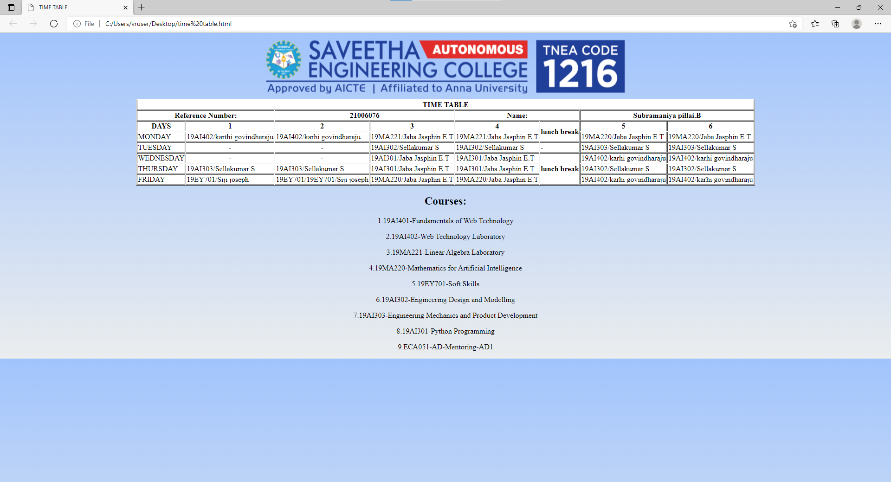

# Experiment_Time_Table

## AIM
To Write a html webpage page to display your timetable.

# ALGORITHM
### STEP 1
create a simple table using table tag
### STEP 2
Add header row using th tag
### STEP 3
Add your timetable
### STEP 4
Execute the program
```
<!DOCTYPE html>
<html lang="en">
<head>
 <title>TIME TABLE</title>
</head>
 <body>
   <center>
   
   </center>
      <table border = "1" cellspacing="1" bgcolor="white" align="center">
        <tr>
            <th colspan="8">TIME TABLE</th>
         </tr>

         <tr>
            <th colspan="2">Reference Number:</th>
            <th colspan="2">21006076</th>
            <th colspan="2">Name:</th>
            <th colspan="2">Subramaniya pillai.B</th>
         </tr>
         
         <tr>
            <th>DAYS</th>
            <th>1</th>
            <th>2</th>
            <th>3</th>
            <th>4</th>
            <th rowspan="2">lunch break</th>
            <th>5</th>
            <th>6</th>
         </tr>

          <tr>
             <td>MONDAY</td>
             <td>19AI402/karthi govindharaju</td>
             <td>19AI402/karhi govindharaju</td>
             <td>19MA221/Jaba Jasphin E.T</td>
             <td>19MA221/Jaba Jasphin E.T</td>
             <td>19MA220/Jaba Jasphin E.T</td>
             <td>19MA220/Jaba Jasphin E.T</td>
         </tr>

         <tr>
             <td>TUESDAY</td>
             <td align="center">-</td>
             <td align="center">-</td>
             <td>19AI302/Sellakumar S</td>
             <td>19AI302/Sellakumar S</td>
             <td>       -            </td>
             <td>19AI303/Sellakumar S</td>
             <td>19AI303/Sellakumar S</td>
         </tr>

         <tr>
             <td>WEDNESDAY</td>
             <td align="center">-</td>
             <td align="center">-</td>
             <td>19AI301/Jaba Jasphin E.T</td>
             <td>19AI301/Jaba Jasphin E.T</td>
             <th rowspan="3">lunch break</th>
             <td>19AI402/karhi govindharaju</td>
             <td>19AI402/karhi govindharaju</td>
         </tr>

         <tr>
             <td>THURSDAY</td>
             <td>19AI303/Sellakumar S</td>
             <td>19AI303/Sellakumar S</td>
             <td>19AI301/Jaba Jasphin E.T</td>
             <td>19AI301/Jaba Jasphin E.T</td>
             <td>19AI302/Sellakumar S</td>
             <td>19AI302/Sellakumar S</td>
         </tr>

        
         <tr>
             <td>FRIDAY</td>
             <td>19EY701/Siji joseph</td>
             <td>19EY701/19EY701/Siji joseph</td>
             <td>19MA220/Jaba Jasphin E.T</td>
             <td>19MA220/Jaba Jasphin E.T</td>
             <td>19AI402/karhi govindharaju</td>
             <td>19AI402/karhi govindharaju</td>
         </tr>
  
         
      </table>
      
      <h2 align="center">Courses:</h2>
      <p align="center">1.19AI401-Fundamentals of Web Technology</p>
      <p align="center">2.19AI402-Web Technology Laboratory</p>
      <p align="center">3.19MA221-Linear Algebra Laboratory</p>
      <p align="center">4.19MA220-Mathematics for Artificial Intelligence</p>
      <p align="center">5.19EY701-Soft Skills</p>
      <p align="center">6.19AI302-Engineering Design and Modelling</p>
      <p align="center">7.19AI303-Engineering Mechanics and Product  Development</p>
      <p align="center">8.19AI301-Python Programming</p>
      <p align="center">9.ECA051-AD-Mentoring-AD1</p>
   <style>
      body {
        background: linear-gradient(to bottom,#a1c4fd,#ebedee);
        color: #000000;}
   </style>
   </body>
</html>
```

# CODE
TIMETABLE

